# Project: GNSS-Track-Analyzer 

## 3D Time-Series Visualization of GNSS NMEA Data and Satellite Signals Using CesiumJS

### Link - https://gnss-track-analyzer.myiotlab.in/

### Video - https://youtu.be/fRjmmJ5SeXo

## Demo Data

Documentation and demo data are provided for academic reference only
and may not be modified or redistributed independently of this repository.

[Download Demo data](https://github.com/subhadipghorui/gnss-track-analyzer-draft/blob/main/demo_data/Track-1.txt)

## Introduction
Global Navigation Satellite Systems (GNSS) have become an essential component of modern life, powering applications ranging from personal navigation and logistics to autonomous vehicles and geospatial research. One of the key challenges in GNSS positioning is signal degradation in dense urban areas, where high-rise buildings cause multipath interference, signal blockage, and increased positioning errors. These urban canyons create complex environments that are difficult to model or interpret using traditional 2D tools. By leveraging 3D visualization researchers can gain deeper insights into the behavior of GNSS signals in real-world environments and its effect on signal quality and accuracy.

## Objectives
How did it all start ?
Existing solutions to analyze and visualize GNSS data is a very tire-some process which include various softwares, lack of free 3D visualization tools.

Our objectives are to create applications to visualize, diagnose and analyze GNSS data (NMEA) in 3D very easily. One can upload any track data in NMEA format that can be recorded via various free apps available in the market (i.e GPS Logger Lite, NMEA Tools, Ultra GPS logger, GnssLogger App by Google) and visualize the accuracy and precision of the data in urban, mountain and city area with high rise buildings. 

### NMEA Data

```
$GNGGA,120605.000,2252.9008,N,08747.5054,E,1,16,0.66,16.8,M,-54.7,M,,*6F
$GPGSA,A,3,32,27,10,23,24,18,31,25,,,,,1.00,0.66,0.75*0F
$GLGSA,A,3,71,73,85,87,86,72,,,,,,,1.00,0.66,0.75*16
$BDGSA,A,3,,,,,,,,,,,,,1.00,0.66,0.75*10
$GAGSA,A,3,19,12,,,,,,,,,,,1.00,0.66,0.75*1B
$GPGSV,4,1,13,32,54,283,21.1,18,52,152,23.5,23,49,048,24.7,10,48,351,31.6*76
$GPGSV,4,2,13,193,34,063,17.0,24,28,048,20.7,194,20,099,23.0,27,19,274,18.3*7E
$GPGSV,4,3,13,31,11,200,14.3,25,08,137,12.2,195,08,147,,08,06,302,*49
$GPGSV,4,4,13,12,03,106,*4C
$GLGSV,3,1,10,86,58,247,18.4,71,36,005,31.9,73,31,093,17.0,72,29,305,14.7*64
$GLGSV,3,2,10,85,28,186,25.2,74,22,147,14.5,87,20,326,20.8,70,12,053,*75
$GLGSV,3,3,10,80,12,044,,65,01,271,*69
$BDGSV,5,1,17,09,80,315,25.7,13,71,117,30.6,02,64,190,,16,64,017,25.1*79
$BDGSV,5,2,17,06,61,023,28.0,03,53,132,,05,49,237,,08,47,130,12.3*61
$BDGSV,5,3,17,27,45,231,24.0,23,39,140,,25,33,076,,30,28,295,22.0*65
$BDGSV,5,4,17,01,22,105,,28,18,177,20.0,07,09,149,,10,09,168,*71
$BDGSV,5,5,17,04,07,098,*5C
$GAGSV,2,1,8,12,60,298,13.3,19,56,354,22.6,04,33,271,,21,17,116,*58
$GAGSV,2,2,8,11,10,324,,26,10,155,,01,09,164,,27,07,068,*57
$GNRMC,120605.000,A,2252.9008,N,08747.5054,E,1.908,5.40,240721,,,A*4D
$GNVTG,5.40,T,,M,1.908,N,3.536,K,A*21
$PMTKTSX1,104815,-26003.384,36.453,35.229,627e0000,-2.596895,-2.600338,-0.447344,-0.191050,0.310917,-2.608*08
$PMTKGEPH,11,0,0,0,0,0,0,0,1,0,1,0,1,0,0,0,0,0,1,0,0,0,0,1,1,1,0,1,1,0,0,1,1*35
$PMTKGALM,31,1,1,1,1,1,1,1,1,1,1,1,1,1,1,1,1,1,1,1,1,1,1,1,1,1,1,1,0,1,1,1,1*2A
$GNACCURACY,2.4*10
$PMTKAGC,120605.000,5503,5560,6789,6948,0,0,0*6F
```

## Goals

- Create use friendly application to visualize GNSS data with capabilities like satellite signal analysis
- 2D/3D visualization of tracking coordinates to see positional and also height accuracy in different environments like urban areas, roads with high-rise buildings, areas with dense vegetation cover etc.
- Comparing multiple dataset for comparison for data quality and further analysis.
- Simulation data source and real-time monitoring of satellite signals.

## Why is Cesium Ideal for 3D Visualization of GNSS Track Data ?

- Cesium is open source and offers an accurate, high-resolution 3D globe (Free Cesium World Terrain 3D Tiles) that enables realistic visualization of GNSS data in real-world terrain and cityscapes. 
- Cesium built-in Geojson data support helps to plot large GNSS log data easily. Onclick view properties with Cesium Infobox, Clamp to ground feature to project 3D data to terrain model. Cesium's built-in time-dynamic capabilities like CZML and SampledPositionProperty allow smooth playback and analysis of GNSS track data over time. 
- Built-in time slider which has most of the things you need for time series data visualization. Helper functions like Cartesian3 to convert coordinates and JulianDate to convert time are very useful to convert datetime strings. 
- Cesium runs directly in web browsers with no installation, making it accessible for demonstrations, collaboration, and public sharing. WebGL GPU-accelerated rendering, which gives smooth experience during simulation of data. 
- As CZML does support extra metadata, we used a local browser-based database (dexie.js) to store coordinates metadata with dataIndex tag. During simulation we use the difference between start and current time to get the data index and query the data from the database.


## Data Collection

1. To prepare the tracking data we used a modern android phone (Samsung Galaxy S20 FE) with a free android app - <b>Ultra GPS Logger</b> available  on playstore to log NMEA data and then save it in a text file. 
2. Then we move the file into the computer and upload it to the application for visulization.

## Application Flow - Step by step

- Step 1: Upload NMEA text file to data upload panel recorded via smart phone. Add custom styling like point size, path line width and also their colors. If you want to plot 3D data select `use altitude` from data which will consider height from NMEA (MSL + Geoidal Separation) data otherwise it will be 0 in meters.


- Step 2: After creating, go to the Layers panel to see uploaded data in layer panel. In case of 3D visualization,  you can also clamp the layer to ground which is good for road data. You can toggle the on/off layer and also remove the layer from the map. On Click you can visualize the metadata of any point and see the satellite signal chart below (Check `Layout -> Bottom panel` ).

- Step 3: By default satellites are visible on click of any coordinate, we can hide by toggling the checkbox from the layer panel and also filter by elevation angle `0, 30, 60 degree`.

- Step 4: To create a simulation go to Simulation Control  and add layer to simulation layer. Add style and select `Use Altitude from data` to draw 3D otherwise it will be 2D height will be 0. After adding click on play  button to start the simulation and open the bottom panel to also see the meta data of each point. By default satelites will be visible to the map, user can uncheck `Show Satellites` options to hide satelites. At last click reset `X` to remove the simulation layer.


## Gallery

Below are screenshots and illustrations demonstrating the application's features and workflow:

### 1. Home Page
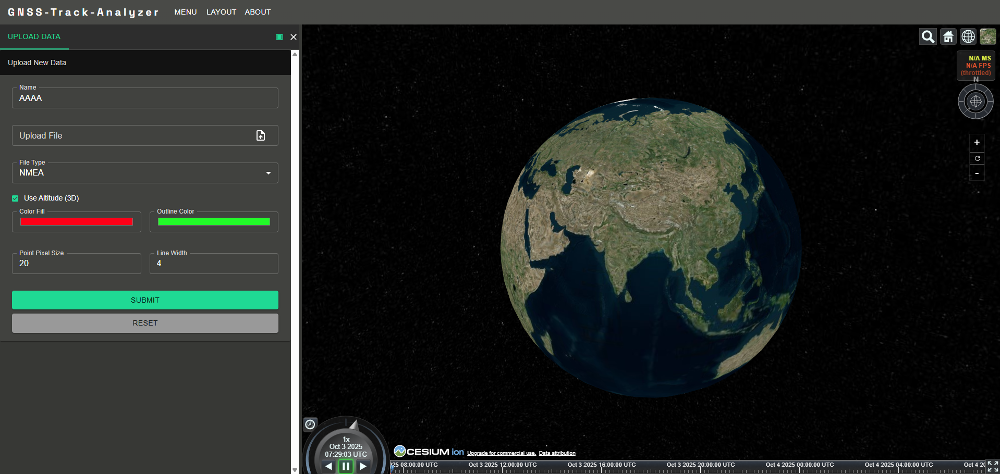
*Application home page overview.*

### 2. Upload NMEA TXT
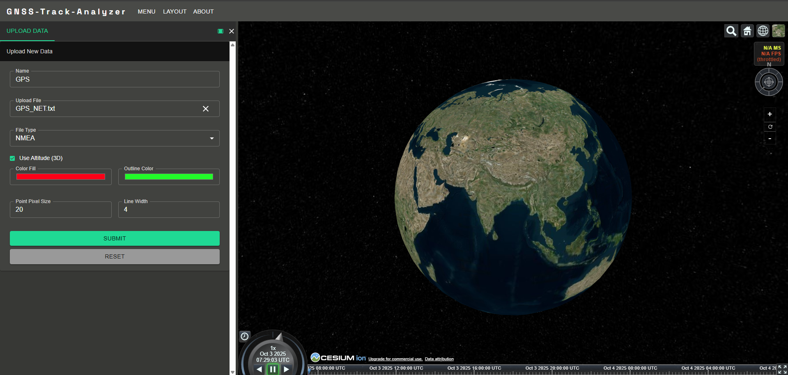
*Upload GNSS NMEA text file for visualization.*

### 3. Zoom to Layer BBox
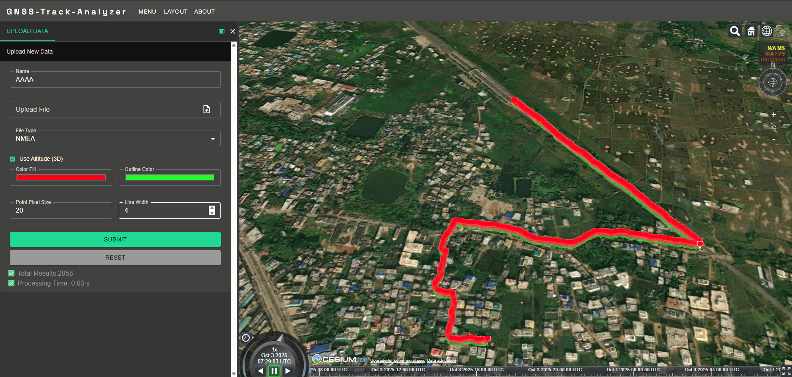
*Zoom to bounding box of selected data layer.*

### 4. Layer Panel
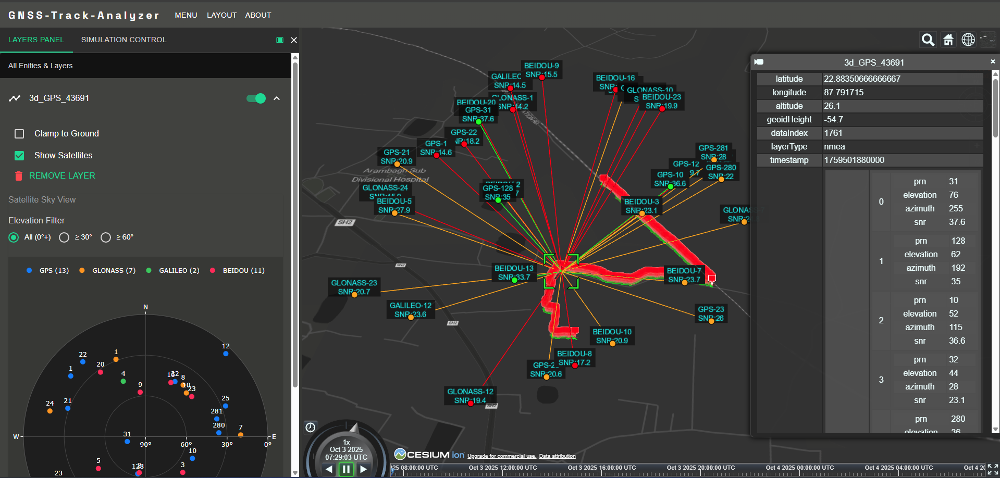
*Layer Filter.*

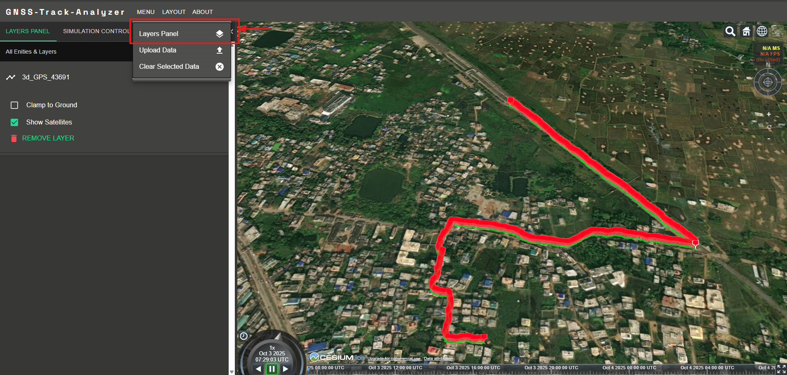
*Manage uploaded data layers and toggle visibility.*

### 5. Clear Selected Data
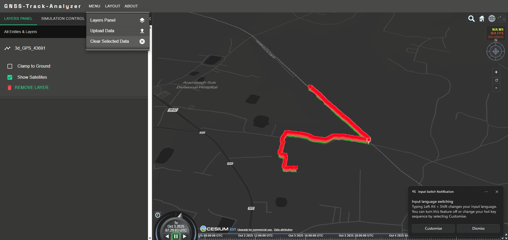
*Remove selected data from the map.*

### 6. Open Satellite Panel
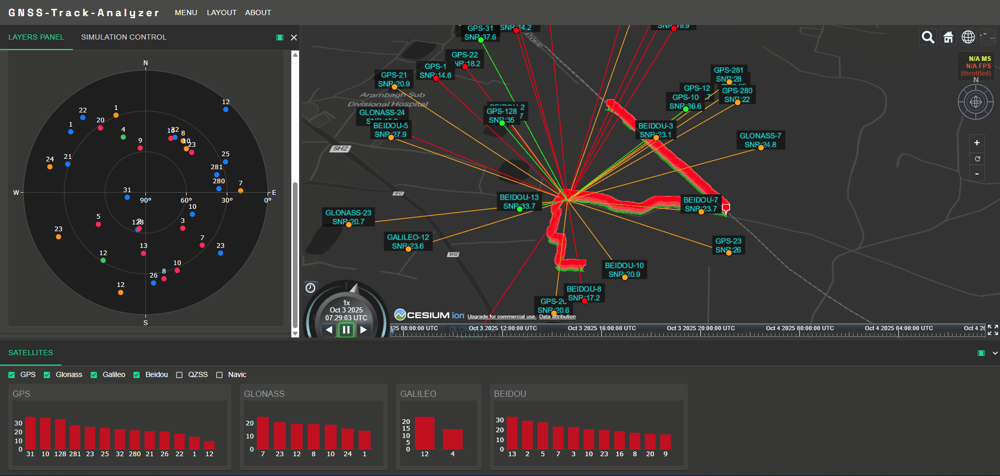
*Open the satellite information panel for analysis.*

### 7. Simulation Control Panel
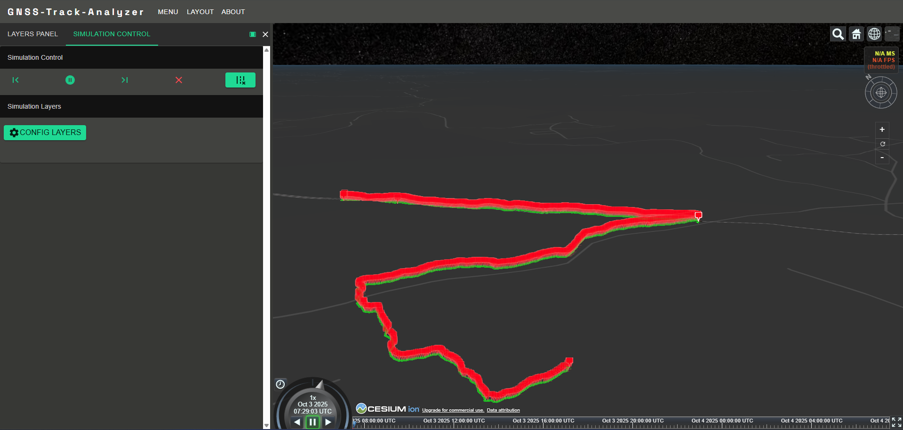
*Configure and control GNSS track simulation.*

### 8. Add Simulation Layer
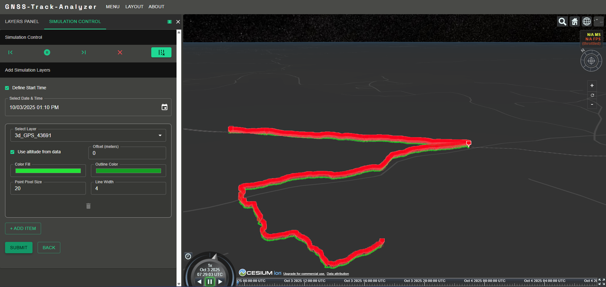
*Add a data layer to the simulation.*

### 9. Simulation Play
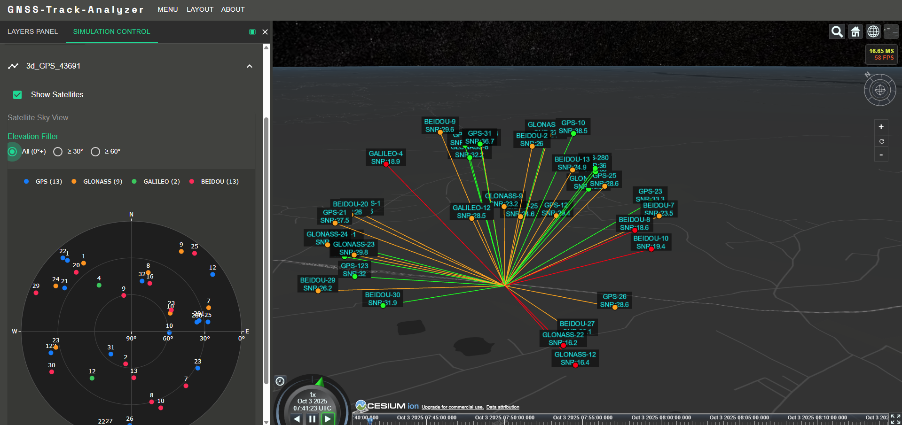
*Start simulation playback of GNSS track.*

### 10. Hide Satellites
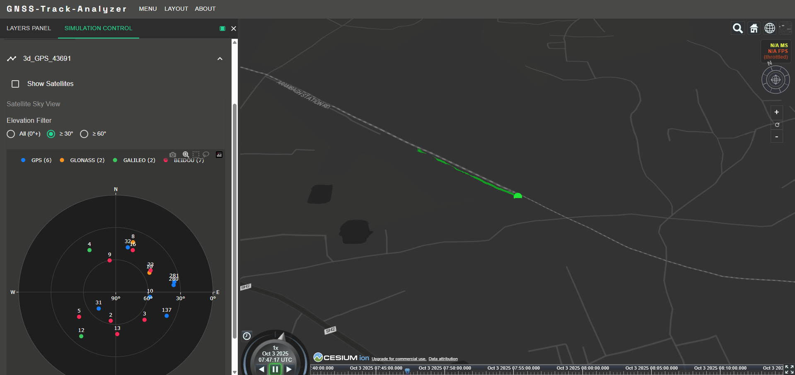
*Toggle satellite visibility on the map.*

### 11. Satellites Filters and Signal Charts
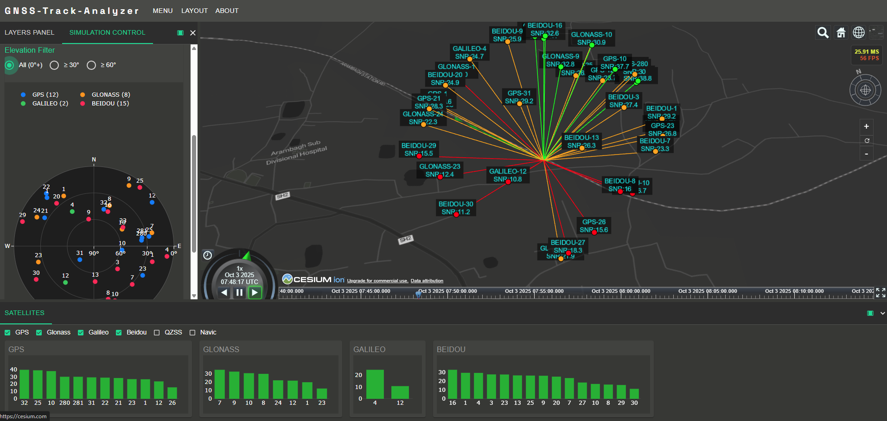
*Filter satellites and view signal charts for analysis.*

### 12. Clear Simulation Layers
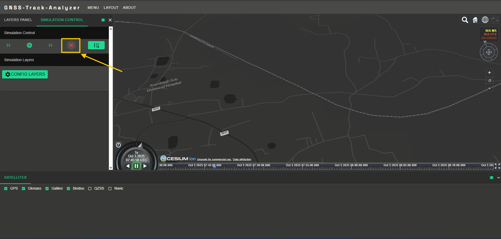
*Remove all simulation layers from the map.*

## License

This project is distributed under a **Proprietary Academic Use License**.

- Free to use for non-commercial academic research and publications
- Attribution to the GitHub repository and author(s) is required
- Modification, redistribution, or publication of the source code is not permitted
- Commercial use is prohibited without prior written permission

Please refer to the LICENSE file for full terms.